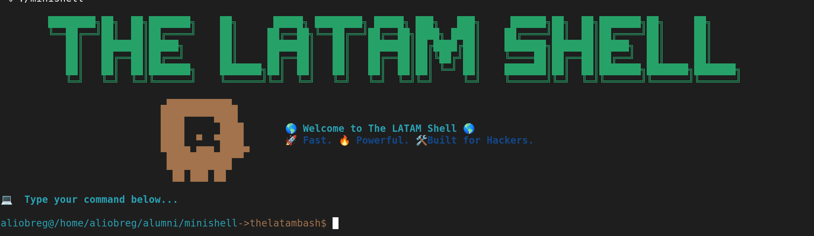

# Minishell
Minishell es un proyecto desarrollado como parte del currículo de la escuela 42. El objetivo es recrear una shell mínima que interprete y ejecute comandos de manera similar a `bash`, incluyendo funcionalidades esenciales como redirecciones, pipes, variables de entorno y más.

## 🚀 Objetivo del proyecto

Implementar una shell simple capaz de:
- Leer comandos desde la entrada estándar.
- Ejecutar programas con sus argumentos.
- Gestionar redirecciones (`<`, `>`, `>>`, `<<`).
- Soportar pipes (`|`).
- Manejar variables de entorno.
- Implementar comandos `builtins`.
- Gestionar correctamente las señales como `Ctrl+C` y `Ctrl+\`.

---

## 🧠 Funcionalidades principales

✅ Lectura y parsing de comandos  
✅ Ejecución de comandos del sistema  
✅ Pipes y redirecciones  
✅ Variables de entorno (`export`, `$VAR`, etc.)  
✅ Comandos `builtins`: `cd`, `echo`, `pwd`, `export`, `unset`, `env`, `exit`  
✅ Soporte para comillas simples y dobles  
✅ Gestión de errores  
✅ Manejo de señales  
✅ Heredoc (`<<`)  

---
## Screenshots



## ⚙️ Compilación
### Requisitos
🛠️ GNU Make

🧠 Compilador C compatible (recomendado: gcc)

💻 Sistema Unix (Linux o macOS)

### Pasos
Clona el repositorio:
<pre>git clone https://github.com/usuario/minishell.git 
cd minishell  </pre>
Compila el proyecto:
<pre>make</pre>
Ejecuta Minishell:
<pre>./minishell</pre>

## 💡 Ejemplos de Uso
<pre>
# Comandos simples
$ ls -l
$ echo "Hola Mundo"

# Pipes
$ ls -l | grep .c

# Redirecciones
$ echo "Hola" > archivo.txt
$ cat < archivo.txt

# Variables de entorno
$ export NOMBRE=Alison
$ echo $NOMBRE

# Heredoc
$ cat << EOF
> Hola
> Mundo
> EOF
</pre>
## 📦 Built-in Commands Implementados
| Comando  | Descripción                       |
| -------- | --------------------------------- |
| `cd`     | Cambiar el directorio actual.     |
| `echo`   | Mostrar una línea de texto.       |
| `pwd`    | Mostrar el directorio actual.     |
| `export` | Establecer variables de entorno.  |
| `unset`  | Eliminar variables de entorno.    |
| `env`    | Mostrar las variables de entorno. |
| `exit`   | Salir de la shell.                |

## 🔍 Cómo funciona internamente
Minishell se divide en varios módulos que trabajan juntos para interpretar y ejecutar los comandos introducidos por el usuario. A continuación se describe el flujo principal de funcionamiento:
### 1. Inicio del bucle de shell

-Se muestra un prompt personalizado.

-Se espera una entrada del usuario.

### 2. Lectura y parsing del comando

-La entrada se lee mediante readline().

-Se tokeniza, detectando comillas, redirecciones y pipes.

-Se construye una estructura de datos que representa los comandos y sus relaciones (por ejemplo, pipe entre comandos).

### 3. Expansión de variables

-Se identifican y reemplazan las referencias a variables del entorno ($VAR) usando getenv().

### 4. Gestión de redirecciones y heredoc

-Se crean y gestionan los file descriptors para redirecciones (<, >, >>).

Si se detecta <<, se ejecuta un heredoc temporal hasta encontrar el delimiter.

### 5. Ejecución de comandos

-Si el comando es built-in, se ejecuta directamente en el proceso padre.

-Si es un comando externo, se utiliza fork() y execve() para ejecutarlo en un proceso hijo.

-Si hay pipes, se configuran los file descriptors y se crean múltiples procesos enlazados.

### 6. Gestión de señales

-Minishell captura y gestiona señales como SIGINT (Ctrl+C) y SIGQUIT (Ctrl+) para evitar cierres inesperados.

### 7. Limpieza y loop

-Se liberan recursos.

-Se repite el bucle para esperar el próximo comando.


```bash


## Authors

- [@alisonobregon](https://www.github.com//alisonobregon)
- [@GGbass](https://www.github.com//GGbass)


